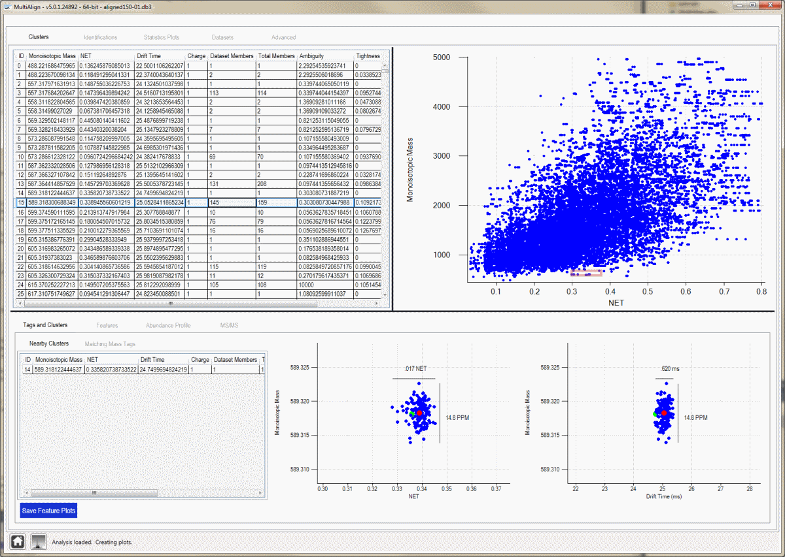
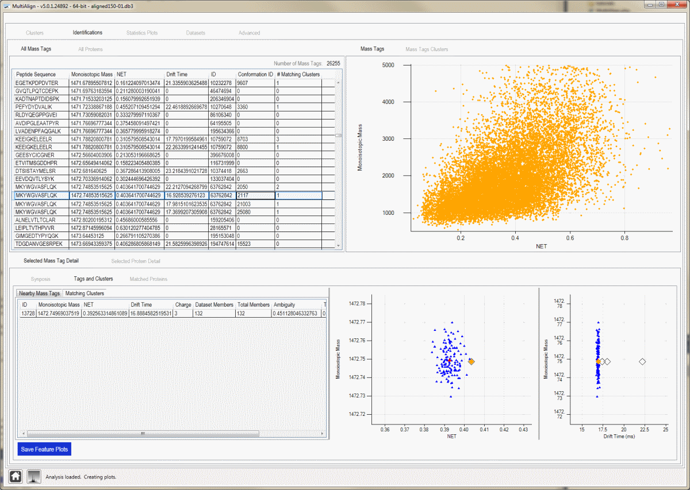

# __MultiAlign__
Aligns multiple LC-MS datasets to one another after which LC-MS features can be matched to a database of peptides (typically an AMT tag database)

### Description
The MultiAlign program can read ICR2LS and [Decon2LS](https://pnnl-comp-mass-spec.github.io/DeconTools/) files and match the features found to an LC-MS/MS Accurate Mass and Time Tag database generated by the [APE](https://github.com/PNNL-Comp-Mass-Spec/APE-DLL) application in SQLite format. If using MultiAlign inside PNNL, you can also load data from the Mass and Time tag System (MTS).

The MultiAlign application provides advanced visualization and manipulation capabilities for LC-MS datasets acquired on high resolution mass spectrometers. Functionalities include overlaid 2D plots, alignment plots, normalizations, and basic statistical comparisons. MultiAlign uses the LCMSWARP algorithm to align LC-MS datasets to a master list (mass tag database or a single LC-MS dataset) and then consolidate features into a consensus map. These features can be matched to an AMT tag database to identify the LC-MS features. Data processing is similar to that performed with the VIPER application, but MultiAlign has the advantage of finding consensus features followed by matching to an AMT tag DB. The processing performed by MultiAlign results in fewer "missing values" vs. the results obtained when analyzing separate datasets with VIPER.

##### Screenshots
Cluster View:

This view shows all clusters found by MultiAlign, offers interactive plots, and the ability to drill from a cluster to raw spectra. Selecting a cluster in the data grid will display cluster details at the bottom of the screen.

Identifications - Mass Tag View:

This view shows all clusters found by MultiAlign, offers interactive plots, and the ability to drill from a cluster to raw spectra. Selecting a cluster in the data grid will display cluster details at the bottom of the screen.

##### 3rd Party Library Support

These installers do not supply the required DLL's to read Thermo Scientific Raw Files. You must download these DLL's separately and install them independently. You may do this after installing MultiAlign. They are available from the Thermo Scientific raw file reader library download page.

### Downloads
* [Source code on GitHub](https://github.com/PNNL-Comp-Mass-Spec/VIPER)
* [MultiAlign GUI App](https://github.com/PNNL-Comp-Mass-Spec/MultiAlign/releases/tag/GUI_v6.1.2)
* [MultiAlign Console App](https://github.com/PNNL-Comp-Mass-Spec/MultiAlign/releases/tag/v5.0.3)
* [MultiAlign Rogue](https://github.com/PNNL-Comp-Mass-Spec/MultiAlign/releases/tag/Rogue_v1.0.6193)
* [MultiAlign Parameter Pack](MultiAlignParameterPack.zip)

#### Tutorial Downloads
* [Example Shewanella AMT Tag Database](shewanella_P823_database.ape)
* [Tutorial 01 - Getting Started](MultiAlignTutorial-01-QuickStartGuide.pdf)
* [Tutorial 02 - Data Tutorial](MultiAlignTutorial-02-DataTutorial.pdf)
* [Tutorial 03 - Running an Analysis](MultiAlignTutorial-03-RunningAnalysis.pdf)
* [Tutorial 04 - Reviewing an Analysis](MultiAlignTutorial-04-ReviewingAnalysis.pdf)

#### Software Instructions
The GUI and console apps are for older versions of MultiAlign, released in 2013 and 2014.  The GUI was revamped in 2016, and is titled MultiAlign Rogue.  This software is a beta release.  Please contact us at proteomics@pnnl.gov with issues using MultiAlign Rogue.

### Acknowledgment

All publications that utilize this software should provide appropriate acknowledgement to PNNL and the MultiAlign GitHub repository. However, if the software is extended or modified, then any subsequent publications should include a more extensive statement, as shown in the Readme file for the given application or on the website that more fully describes the application.

### Disclaimer

These programs are primarily designed to run on Windows machines. Please use them at your own risk. This material was prepared as an account of work sponsored by an agency of the United States Government. Neither the United States Government nor the United States Department of Energy, nor Battelle, nor any of their employees, makes any warranty, express or implied, or assumes any legal liability or responsibility for the accuracy, completeness, or usefulness or any information, apparatus, product, or process disclosed, or represents that its use would not infringe privately owned rights.

Portions of this research were supported by the NIH National Center for Research Resources (Grant RR018522), the W.R. Wiley Environmental Molecular Science Laboratory (a national scientific user facility sponsored by the U.S. Department of Energy's Office of Biological and Environmental Research and located at PNNL), and the National Institute of Allergy and Infectious Diseases (NIH/DHHS through interagency agreement Y1-AI-4894-01). PNNL is operated by Battelle Memorial Institute for the U.S. Department of Energy under contract DE-AC05-76RL0 1830.

We would like your feedback about the usefulness of the tools and information provided by the Resource. Your suggestions on how to increase their value to you will be appreciated. Please e-mail any comments to proteomics@pnl.gov
